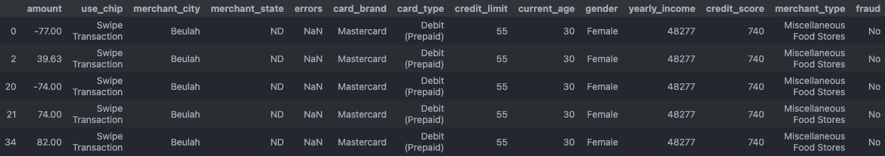
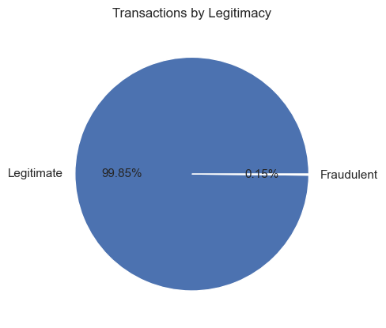
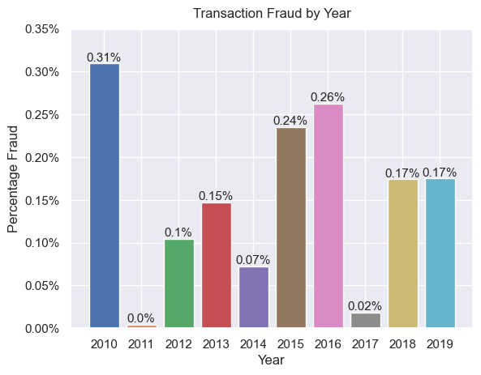
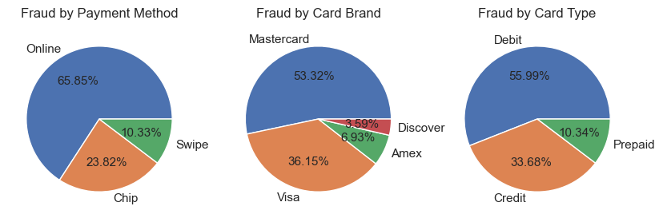
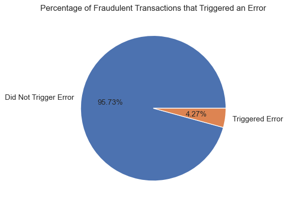
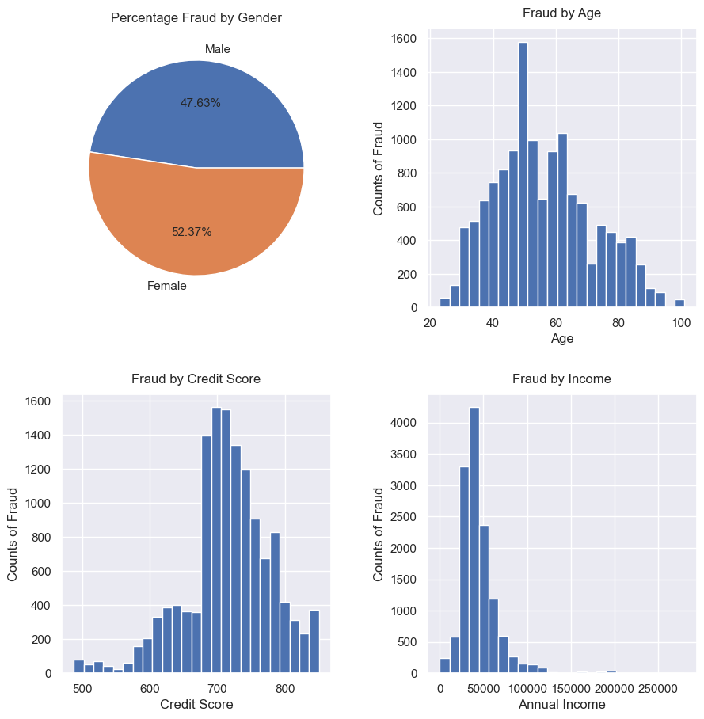
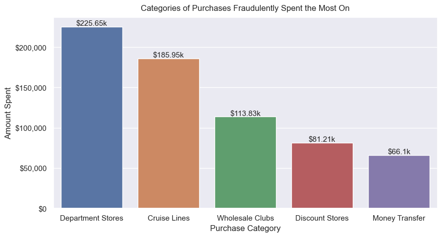
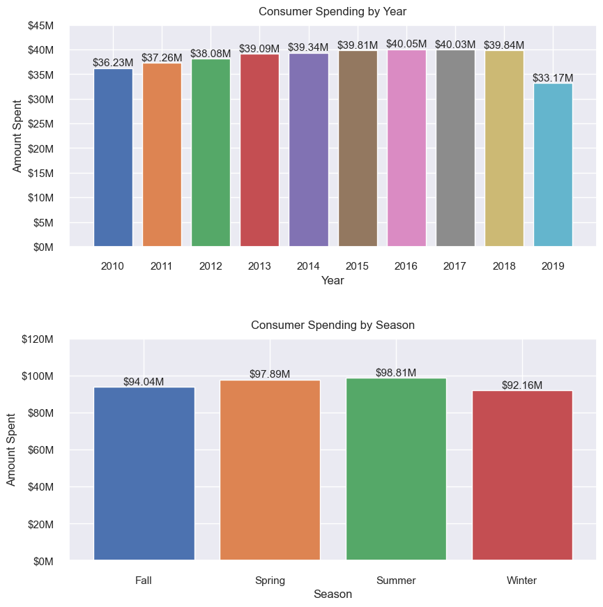
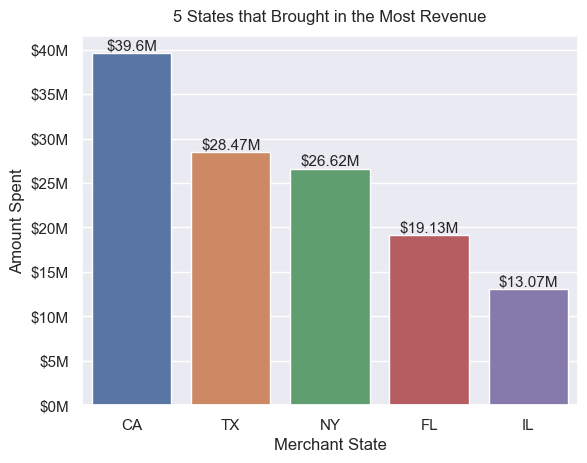
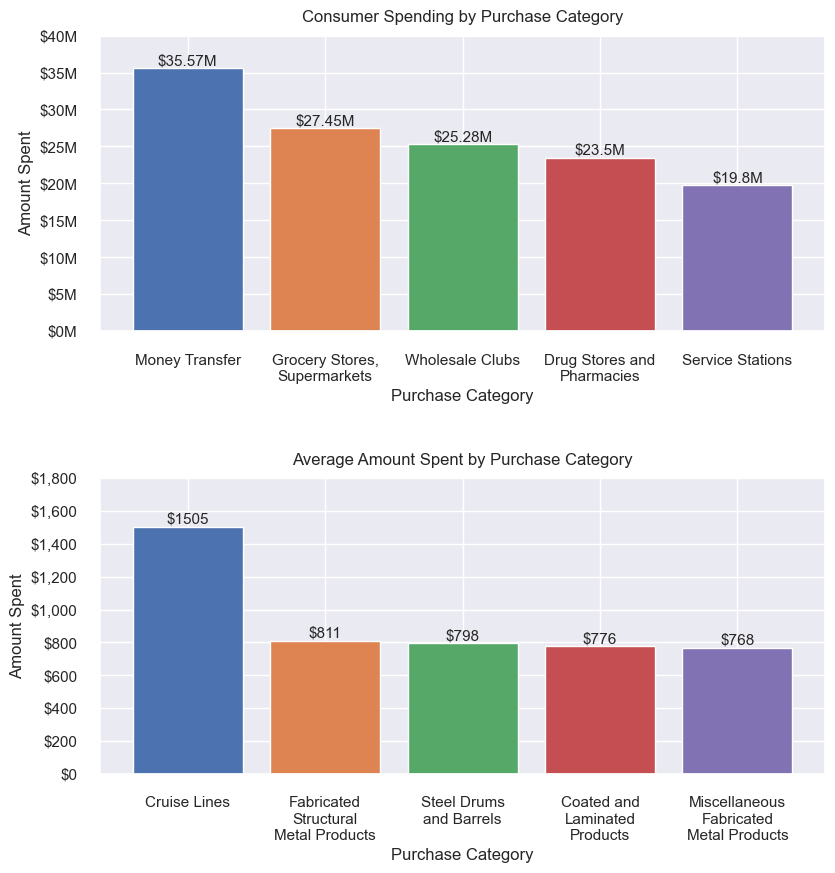

# Analyzing Consumer Spending & Transaction Fraud

##  Overview
In this project, I analyzed financial transaction data between 2010 and 2019 using pandas and matplotlib. 

View [code](https://github.com/aanshkapadia/credit-card-transactions/blob/main/analysis.ipynb) |  [dataset](https://www.kaggle.com/datasets/computingvictor/transactions-fraud-datasets)

## Data Preparation
To prepare for analysis, I imported each file into separate dataframes (transactions, users, cards, merchant info, fraud labels), merged them together based on relevant IDs, and then finally removed any unnecessary columns. Additionally, I made sure to clean columns containing values representing dollar amounts by removing non-numeric characters (ex. '$') and then converting their data types from string to either integer or float.

  

## [Analysis] Fraudulent Transactions

### Q1: What percentage of total transactions were fraudulent?
  

### Q2: Which year had the highest percentage of fraud?
  

### Q3: How did fraud differ by payment method, card brand, and card type?
  

### Q4: What percentage of fraudulent transactions triggered an error?
  

### Q5: What were the demographics of frauded customers?
  

### Q6: What types of purchases were fraudulently spent the most on?
  

## [Analysis] Transaction Amount

### Q1: Which year and season accounted for the largest amount of revenue?
  

### Q2:  Which states brought in the most revenue?
  

### Q3:  What type of purchases did consumers spend the most on? And on average?
  